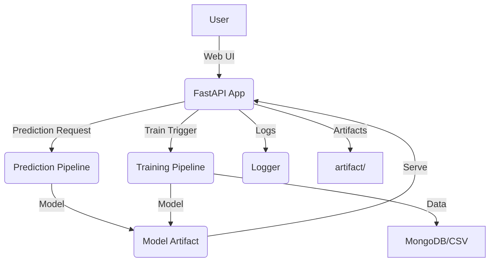

# Vehicle Insurance Prediction - MLOps Project

[](https://github.com/Dinesh-Kumar-Verma/Vehicle_Insurance_domain_project)


## Overview

This project predicts customer response to vehicle insurance offers using machine learning. It demonstrates a full MLOps workflow: data ingestion, validation, transformation, model training, evaluation, and deployment. The project is production-ready, featuring CI/CD, cloud deployment, containerization, and data versioning.

---

## Table of Contents

- [Project Structure](#project-structure)
- [Features](#features)
- [Tech Stack](#tech-stack)
- [Architecture & System Design](#architecture--system-design)
- [Setup Instructions](#setup-instructions)
- [Usage](#usage)
- [MLOps Pipeline](#mlops-pipeline)
- [API Endpoints](#api-endpoints)
- [Results](#results)
- [License](#license)
- [Contact](#contact)

---

## Project Structure

```
Vehicle_Insurance_domain_project/
│
├── src/
│   ├── components/           # Data ingestion, validation, transformation, model modules
│   ├── entity/               # Config and artifact entities
│   ├── pipline/              # Training and prediction pipelines
│   ├── logger.py             # Logging utility
│   ├── exception.py          # Custom exception handling
│   └── constants.py          # App constants
│
├── app.py                    # FastAPI application
├── requirements.txt          # Python dependencies
├── artifact/                 # Generated artifacts (ingested data, models, etc.)
├── static/                   # Static files (CSS, JS)
├── templates/                # HTML templates
├── .github/workflows/        # CI/CD pipeline configs
├── Dockerfile                # Docker image specification
├── dvc.yaml                  # DVC pipeline configuration
├── .dvc/                     # DVC cache and metadata
└── README.md                 # Project documentation
```

---

## Features

- **End-to-End MLOps Pipeline:** Data ingestion, validation, transformation, model training, evaluation, and deployment.
- **FastAPI Web App:** User-friendly interface for predictions and triggering model training.
- **CI/CD Integration:** Automated testing, building, and deployment via GitHub Actions.
- **Cloud Deployment:** Application deployed on AWS EC2 using Docker; container images pushed to AWS ECR.
- **Data Versioning:** Data and model artifacts tracked with DVC for reproducibility.
- **Modular Codebase:** Clean separation of concerns for maintainability.
- **Logging & Exception Handling:** Robust error tracking and debugging.
- **Artifact Management:** Organized storage of datasets and models.

---

## Tech Stack

- **Python 3.8+**
- **FastAPI** (Web framework)
- **Uvicorn** (ASGI server)
- **Pandas, NumPy, Scikit-learn** (ML & data processing)
- **Jinja2** (HTML templating)
- **MongoDB** (Optional, for data storage)
- **Docker** (Containerization)
- **AWS EC2 & ECR** (Cloud deployment & image registry)
- **GitHub Actions** (CI/CD)
- **DVC** (Data & model versioning)

---

## Architecture & System Design

### High-Level Architecture



### System Design

- **Frontend:** HTML/Jinja2 templates served by FastAPI.
- **Backend:** FastAPI handles requests, triggers pipelines, and serves predictions.
- **ML Pipelines:** Modular classes for each stage (ingestion, validation, transformation, training, evaluation, pusher).
- **Data Tracking:** DVC tracks raw, processed data and model versions.
- **Containerization:** Dockerfile builds the app image; pushed to AWS ECR.
- **CI/CD:** GitHub Actions automate linting, testing, Docker build, and deployment to EC2.
- **Cloud:** EC2 runs the Docker container; ECR stores images for versioned deployment.

---

## Setup Instructions

1. **Clone the Repository**
    ```sh
    git clone https://github.com/Dinesh-Kumar-Verma/Vehicle_Insurance_domain_project.git
    cd Vehicle_Insurance_domain_project
    ```

2. **Create and Activate Virtual Environment**
    ```sh
    python -m venv venv
    venv\Scripts\activate  # On Windows
    ```

3. **Install Dependencies**
    ```sh
    pip install -r requirements.txt
    ```

4. **Set Up DVC**
    ```sh
    dvc pull
    ```

5. **Run the FastAPI App Locally**
    ```sh
    uvicorn app:app --host 127.0.0.1 --port 5000
    ```
    - Access the app at [http://127.0.0.1:5000/](http://127.0.0.1:5000/)

6. **Build and Run with Docker**
    ```sh
    docker build -t vehicle-insurance-app .
    docker run -p 5000:5000 vehicle-insurance-app
    ```

7. **Cloud Deployment**
    - Push Docker image to AWS ECR:
      ```sh
      # Authenticate Docker to ECR
      aws ecr get-login-password --region <region> | docker login --username AWS --password-stdin <account>.dkr.ecr.<region>.amazonaws.com
      # Tag and push
      docker tag vehicle-insurance-app:latest <ecr-repo-url>:latest
      docker push <ecr-repo-url>:latest
      ```
    - Pull and run on EC2:
      ```sh
      docker pull <ecr-repo-url>:latest
      docker run -d -p 5000:5000 <ecr-repo-url>:latest
      ```

---

## Usage

- **Train Model:**  
  Visit `/train` endpoint or click the "Train" button in the UI to start the pipeline.
- **Predict:**  
  Fill out the form on the main page and submit to get insurance response predictions.

---

## MLOps Pipeline

1. **Data Ingestion:** Loads raw data from source (e.g., MongoDB, CSV).
2. **Data Validation:** Checks for missing values, schema consistency.
3. **Data Transformation:** Feature engineering and encoding.
4. **Model Training:** Trains ML model (e.g., RandomForest, XGBoost).
5. **Model Evaluation:** Evaluates model performance on test data.
6. **Model Pusher:** Deploys the trained model for inference.

---

## API Endpoints

- `GET /` : Main form page.
- `POST /` : Submit vehicle data for prediction.
- `GET /train` : Trigger model training pipeline.

---

## Results

- **Model Accuracy:** _Add your best accuracy/metrics here._
- **Sample Prediction:**  
  | Gender | Age | Driving License | ... | Response |
  |--------|-----|----------------|-----|----------|
  | Male   | 54  | 1              | ... | No       |

---

## License

This project is licensed under the MIT License.

---

## Acknowledgements

Special thanks to **Vikas Das** for guidance and support throughout this project.
- **GitHub:** https://github.com/vikashishere
- **GitHub Repo.:** https://github.com/vikashishere/YT-MLops-Proj1


## Contact

- **Author:** Dinesh Kumar Verma
- **GitHub:** [Dinesh-Kumar-Verma](https://github.com/Dinesh-Kumar-Verma)
- **Email:** vermadinesh006@gmail.com
- **LinkedIn:** https://www.linkedin.com/in/dinesh-verma-707126184/

---

_This project demonstrates practical MLOps skills, modular design, CI/CD, cloud deployment, and reproducible data science workflows._
